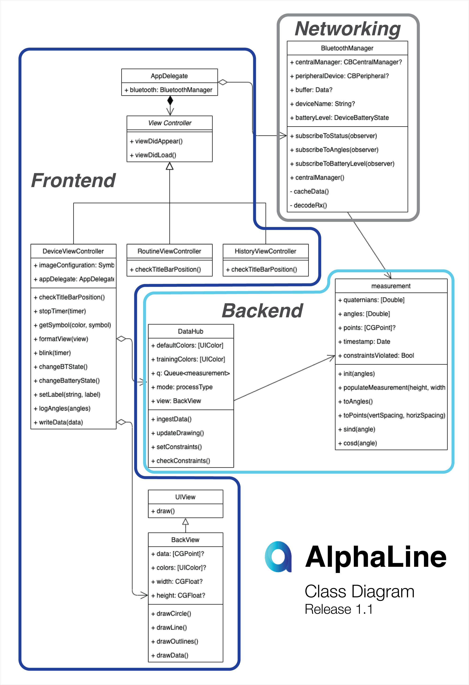
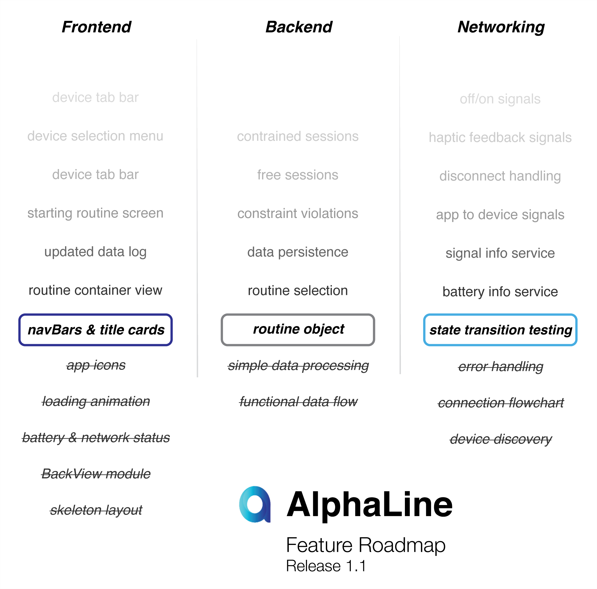

# AlphaLine iOS App

The integral mobile application that receives, processes, and displays the data from our alignment wearable and displays that data to the user in a variety of ways.

***

## Product Demo

***

## Getting Started

### Minimum Requirements

1. iPhone X w. iOS 13+
2. Device running macOS Mojave+

### Installing

- clone the repository into the Xcode IDE
- plug the phone into the laptop and select the connected device
- give associated permissions to the app and approve the app on your device
- run

***

## Internal Design

### Class Diagram

### Feature Plan

***

## Built With

* [Swift](https://developer.apple.com/swift/) - language
* [UIKit](https://developer.apple.com/documentation/uikit) - iOS UI package
* [CoreBluetooth](https://developer.apple.com/documentation/corebluetooth) - iOS bluetooth package
* [SwiftyGif](https://github.com/kirualex/SwiftyGif) - GIF display engine

## Authors

* **Dylan Cauwels** - *Frontend & Backend*
* **Jarrad Cisco** - *Networking & Backend*
* **Danny Maclean** - *Graphic Design*

## Copyright

This project is protected under the UT Entrepreneurship Senior Design Intellectual Property agreement, project members hold all IP for the project

## Acknowledgments

* **Dr. Anthony Johnson** - Medical Advisor @ Dell Medical School
* **Dr. Jonathan Valvano** - Faculty Advisor @ UT Department of ECE
* **Professor Mark McDermott** - Course Instructor
* **Rita Kambil** - Teaching Assistant
